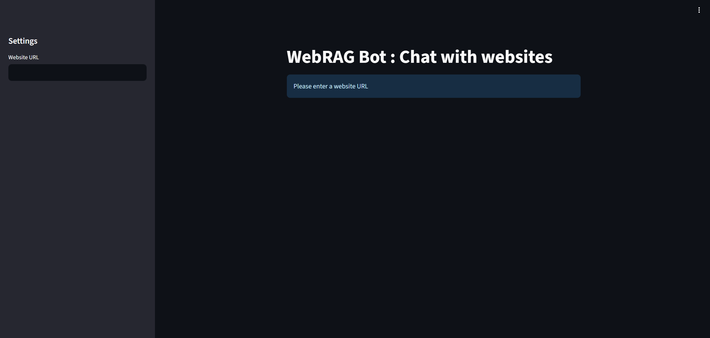
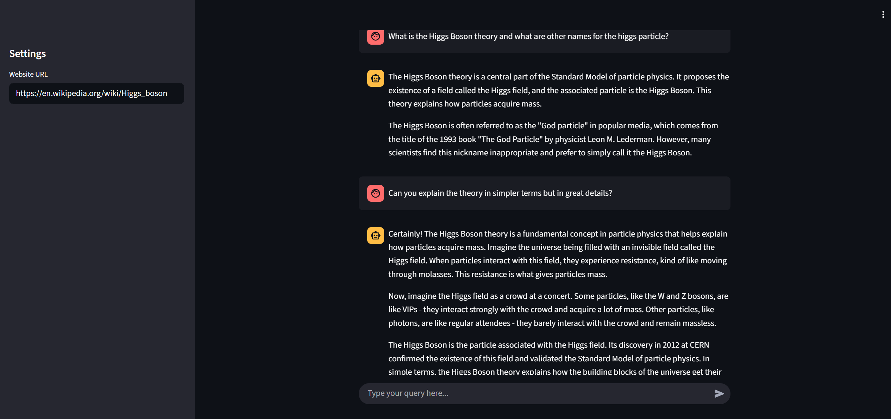

# WebRAG_Bot

WebRAG Bot: Chat with Websites
WebRAG Bot is an interactive Streamlit application that leverages the power of Retrieval-Augmented Generation (RAG) to enable conversational queries on any website's content. By simply providing a URL, users can chat with the website, asking questions and receiving context-aware answers.

The application dynamically ingests website content, splits it into chunks, and creates a vector store for efficient semantic search. It uses LangChain's history-aware retrieval and conversational chains to maintain context throughout the dialogue, providing a seamless and intelligent chat experience.

### Application Interface with an Example Conversation

This image shows the main user interface of the WebRAG Bot.
You can see unless the URL is pasted the Chatbot does not start any conversation.

This image demonstrates a typical chat session with the bot, as you can see it can also answer qyestions based on previous context.

